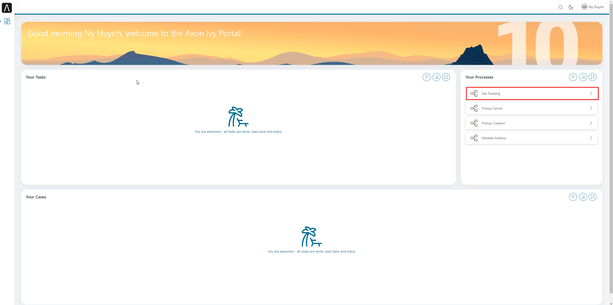
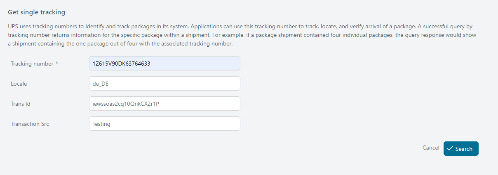
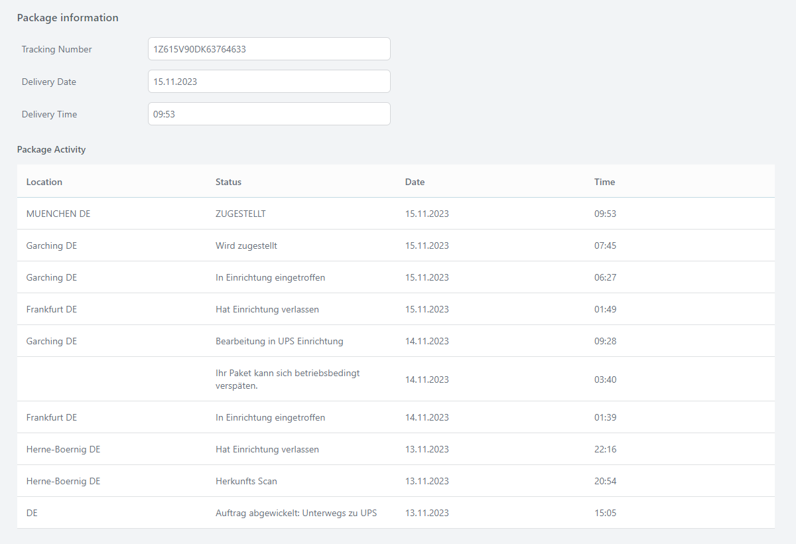
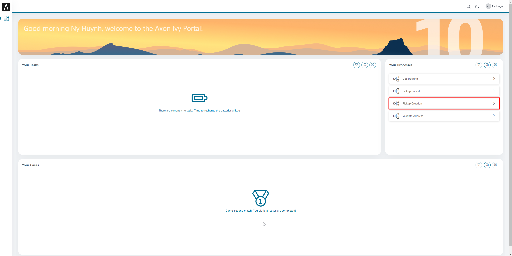
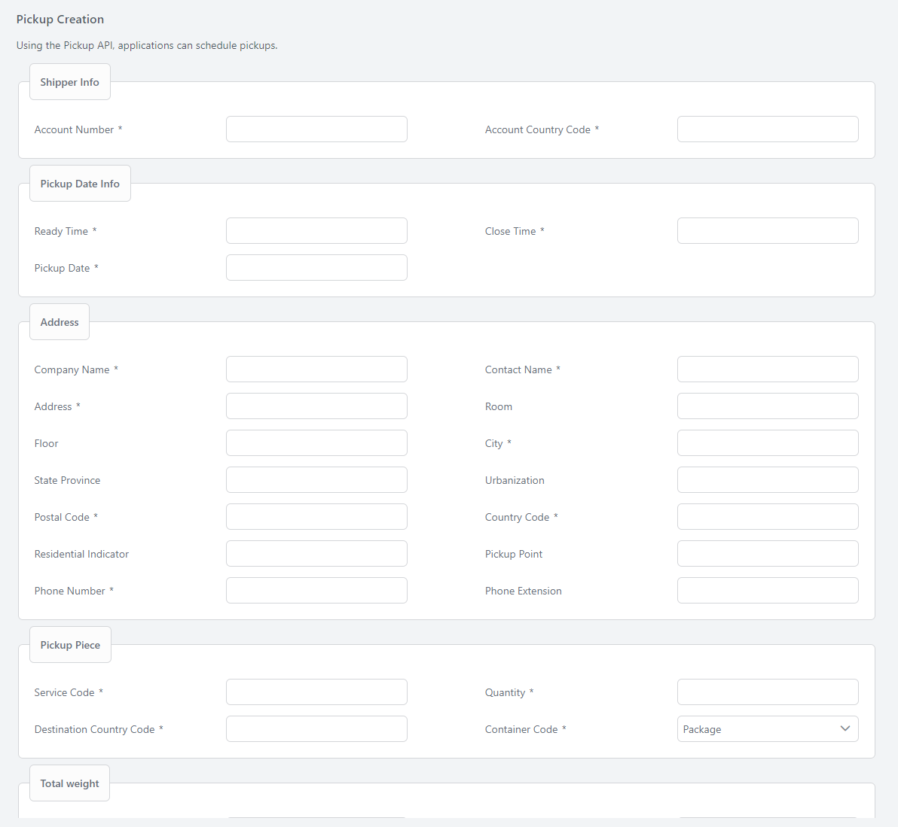
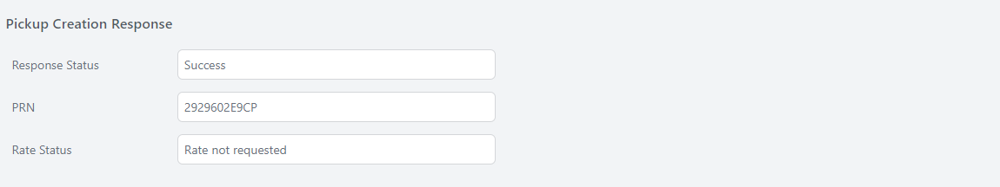
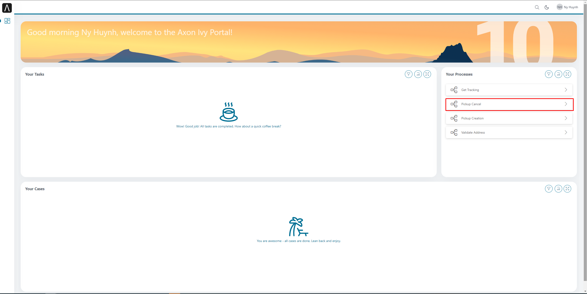
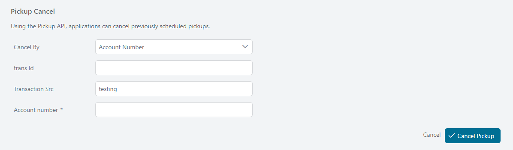
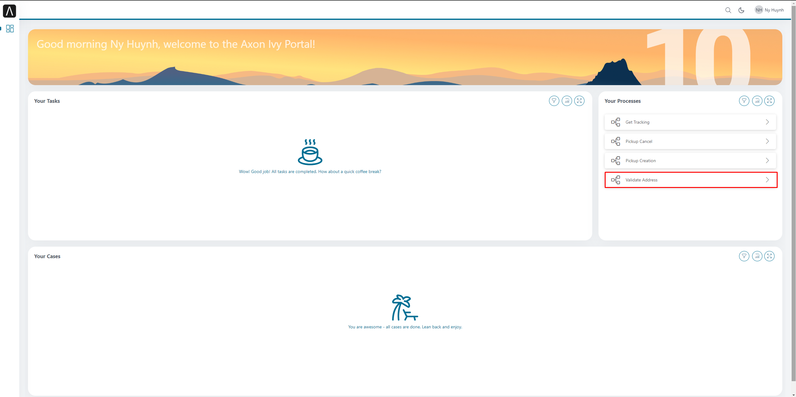
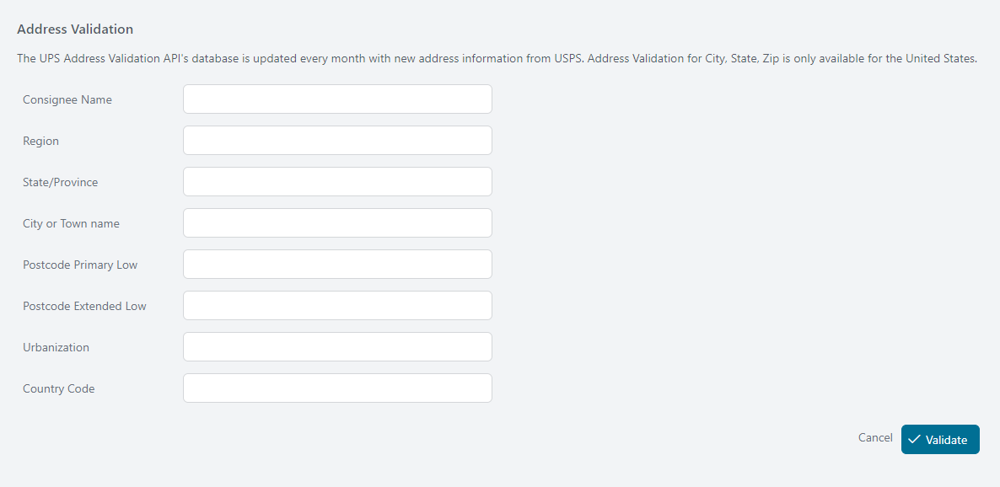

# UPS Modul

Der #Axon Efeu [UPS Anschluss](https://developer.ups.com/catalog) aktiviert
Nutzer zu integrieren UPS Bedienungen #bruchlos hinein irgendwelchen
dienstlichen Arbeitsgang.

Dieser Anschluss:

- Ermächtigt du mit voll Zugang zu den OpenAPI UPS API Katalog
- Bietet tagtägliche Nutzung Fälle wie #rückverfolgen Päckchen, #bekommen
  verschicken Raten, und validierend Adressen

Erkunde das [API katalogisieren](https://developer.ups.com/catalog) zu
identifizieren #welche APIs stimmen ab best mit euren dienstlichen
Notwendigkeiten.

## Demo
### #Bekommen #rückverfolgen Auskunft
Diese Bedienung ist benutzt zu #wiedergewinnen Päckchen Auskunft.
1. Anmeldung zu den #Axon Efeu Portal
2. Auf die Arbeitsgang Liste Seite, Klick weiter **Bekommt #Rückverfolgen**



3. Setz ein eure #rückverfolgen Nummer



4. Klick **Suche** #zuknöpfen zu bekommen alle Auskunft von dem Päckchen



### Schalldose Kreation
Diese Bedienung ist benutzt zu einplanen Schalldosen.
1. Anmeldung zu den #Axon Efeu Portal
2. Auf die Arbeitsgang Liste Seite, Klick weiter **Schalldose Kreation**



3. Einsetzen bedürft #auffangen



4. Klick **Arbeitsgang** #zuknöpfen zu einplanen Schalldosen



### Schalldose streicht
Diese Bedienung ist benutzt zu streichen vorher fahrplanmäßige Schalldosen.
1. Anmeldung zu den #Axon Efeu Portal
2. Auf die Arbeitsgang Liste Seite, Klick weiter **Schalldose Kreation**



3. Einsetzen bedürft #auffangen



4. Klick **Streicht** #zuknöpfen zu beenden

### Adresse Bestätigung
Diese Bedienung ist genutzt zu überprüfen Adressen gegen #die Vereinigten
Staaten Postalische Bedienung Datenbank von gültig Adressen herein die #U.S.
1. Anmeldung zu den #Axon Efeu Portal
2. Auf die Arbeitsgang Liste Seite, Klick weiter **Validiert Adresse**



3. #Einsetzen #adressieren info



4. Klick **Validiert** Knopf

## Einrichtung
1. Geh zu https://Entwickler.ups.com, Anmeldung mit eurem Nutzer oder schaffen
   ein neues UPS Konto.
2. Schaff weiter einen Antrag UPS
3. Einmal ist geschafft eure Antrag, der **Kunde ID** und **Kunde Geheimnis**
   ist generiert und kann sein benutzt zu bekommen eine Zugang Automatenmünze
   für autorisieren eure API Bitten
4. Konfigurier die folgenden Variablen in eurem Projekt:
```
@variables.yaml@
```
> [!BEACHTE] Den variablen Pfad `ups-Anschluss` ist #umbenennen zu
> `upsConnector` von 13.1.
